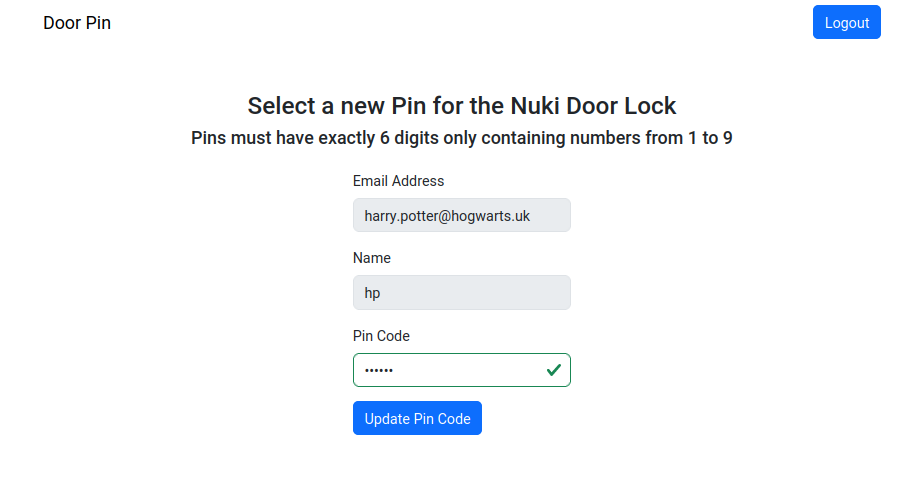

# Nupin

Web service for creation and updating of personal door pins of a Nuki smart lock authorized with oidc.



## Usage

[embedmd]:# (tmp/help.txt)
```txt
Usage of ./nupin:
  -c, --config string   path to Config file
  -h, --help            print help text and exit
```

## Configuration file

The configuration file is expected to be a yaml file with the following schema.

[embedmd]:# (config/config.go /\/\/ Config/ /}$/)
```go
// Config defines the schema of the configuration file.
type Config struct {
	Oidc struct {
		IssuerURL    string `yaml:"issuerUrl"`
		ClientID     string `yaml:"clientId"`
		ClientSecret string `yaml:"clientSecret"`
		RedirectUrl  string `yaml:"redirectUrl"`
		CookieDomain string `yaml:"cookieDomain"`
	} `yaml:"oidc"`
	Web struct {
		// Address is the listen address of the API server.
		Address string `yaml:"address"`
		// InternalAddress is the address the web server listens to for metrics and pprof.
		InternalAddress string `yaml:"internalAddress"`
	} `yaml:"web"`
	Nuki struct {
		// APIKey is the Nuki API token
		APIKey string `yaml:"apiKey"`
		// SmartLockDevice is the ID of the nuki smart lock.
		SmartLockDevice int64 `yaml:"smartLockDevice"`
		// MinimumPinEntropy is the mimimum entropy needed by a pin to be accepted (default: 10)
		MinimumPinEntropy float64 `yaml:"minimumPinEntropy,omitempty"`
	} `yaml:"nuki"`
	// StorageType for the state generated in the oauth2 flow. Options are memory or redis.
	StorageType string `yaml:"storageType"`
	// Redis is the redis configuration. It is only required, if StorageType=redis.
	Redis struct {
		UseSentinel bool `yaml:"sentinel"`
		// FailoverOptions is only required if UseSentinel=true.
		FailoverOptions *redis.FailoverOptions `yaml:"failoverOptions,omitempty"`
		// Options is only required if UseSentinel=false.
		Options *redis.Options `yaml:"options,omitempty"`
	} `yaml:"redis"`
}
```

## k8s

Use the kustomization.yaml file in [k8s](k8s) as a base.
You will need to update the oidc and nuki configuration.
